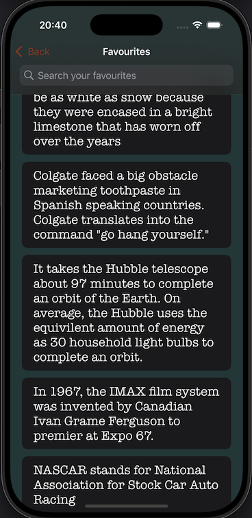

# Facto

A very simple SwiftUI iOS App where we can go through random facts and favourite them. Favourited facts can be viewed offline too.

# Getting Started

1. You will need Xcode to run the project.
2. Either download the project zip or clone the project to your machine.
3. Open the Facto.xcodeproj file.
4. Run the active scheme (Facto). The project also has widget extension.

# Architecture

The project is following Clean Architecture where the components are assigned to 3 different modules. Domain, Data and Presentation. The modules interact through well-defined boundaries, ensuring each layer depends only on abstractions and not on concrete implementations. Navigation is done using the Coordinator. A couple of screenshots for the app is shown below.

# External Frameworks

The project uses Swift Package Manager to manages 3rd party libraries. This is the list of frameworks used.
1. [Lottie](https://github.com/airbnb/lottie-ios) -> This framework renders vector-based animations with very little amount of code on app side.
2. [R.swift](https://github.com/mac-cain13/R.swift) -> This framework provides type-safe access to resources like images, fonts, colors, and storyboards, reducing the risk of runtime errors from hardcoded strings.

# API

The project uses https://api-ninjas.com/api/facts REST api to fetch the facts.
